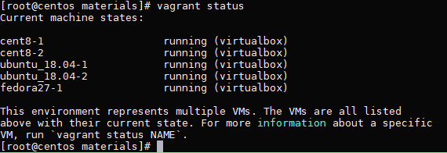
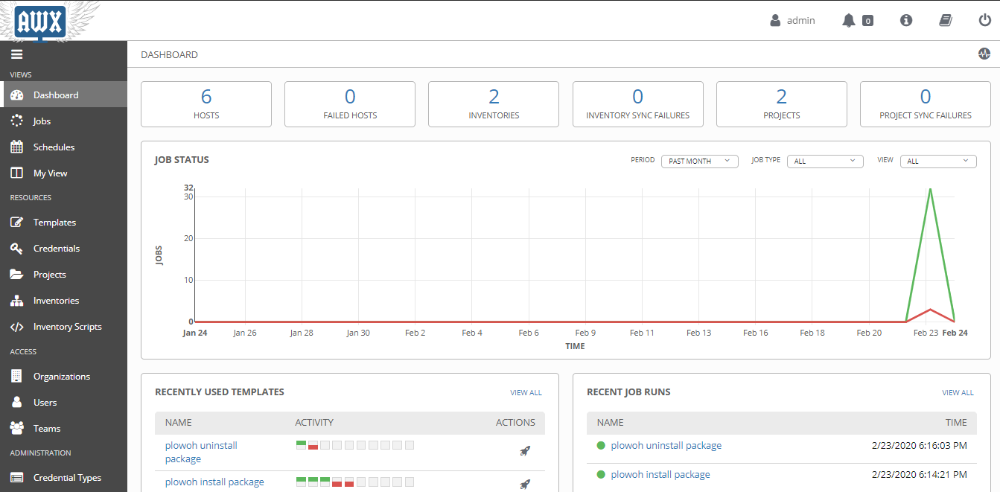
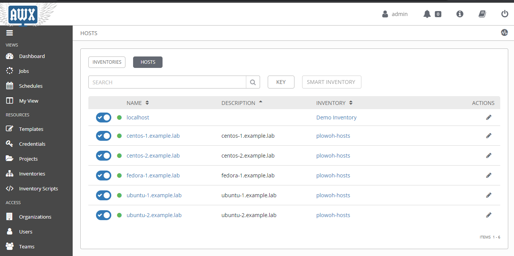

# awx-test
 
## Table of Contents
* [Install VirtualBox](#Install-VirtualBox)
* [Install Vagrant](#Install-Vagrant)
* [Install AWX](#Install-AWX)

### Install VirtualBox
	yum -y update
	yum -y install wget vim tmux rsync kernel-devel kernel-headers  make patch gcc
	wget https://download.virtualbox.org/virtualbox/rpm/el/virtualbox.repo -P /etc/yum.repos.d/
	sed -i 's/enabled=1/enabled=0/g' /etc/yum.repos.d/virtualbox.repo
	setenforce 0
	sed -i 's/SELINUX=enforcing/SELINUX=disabled/g' /etc/selinux/config
	systemctl disable firewalld; systemctl stop firewalld
	yum -y install VirtualBox-6.0 --enablerepo virtualbox
	wget https://download.virtualbox.org/virtualbox/6.0.14/Oracle_VM_VirtualBox_Extension_Pack-6.0.14.vbox-extpack
	VBoxManage extpack install Oracle_VM_VirtualBox_Extension_Pack-6.0.14.vbox-extpack

### Install Vagrant
	yum -y install https://releases.hashicorp.com/vagrant/2.2.6/vagrant_2.2.6_x86_64.rpm
	yum -y install  elfutils-libelf-devel
	/sbin/vboxconfig

### Install AWX
	dnf install epel-release -y
	dnf install -y git gcc gcc-c++ nodejs gettext device-mapper-persistent-data lvm2 bzip2 python3-pip
	dnf config-manager --add-repo=https://download.docker.com/linux/centos/docker-ce.repo
	dnf install -y docker-ce-3:18.09.1-3.el7
	systemctl start docker
	systemctl enable --now docker.service
	alternatives --set python /usr/bin/python3
	pip3 install docker-compose
	git clone https://github.com/ansible/awx.git
	cd awx/installer/
	cat inventory
	
	...
	localhost ansible_connection=local ansible_python_interpreter="/usr/bin/env python3"
	...
	awx_alternate_dns_servers="8.8.8.8"
	...
	
	dnf install ansible --enablerepo epel
	ansible-playbook -i inventory install.yml

### Create VM
	git clone https://github.com/nursanto/awx-test.git
	cd awx-test/materials/
	vagrant up
	vagrant status
it will create 5 vm. For the first time it takes about 10minute depand on your internet connection.

### Access AWX Dashboard
awx dashboard can be accessed form host IP Address. with user=admin, password=password

After 'vagrant up' completed, that will create 5 vm with the following details.

|      IP    	|       Hostname       |       u/p       |
|---------------|----------------------|-----------------|		
| 172.42.42.101 | centos-1.example.lab | plowoh/password |
| 172.42.42.102 | centos-2.example.lab | plowoh/password |
| 172.42.42.111 | ubuntu-1.example.lab | plowoh/password |
| 172.42.42.112 | ubuntu-2.example.lab | plowoh/password |
| 172.42.42.121 | fedora-1.example.lab | plowoh/password |

add that vm to host in awx, and good luck..